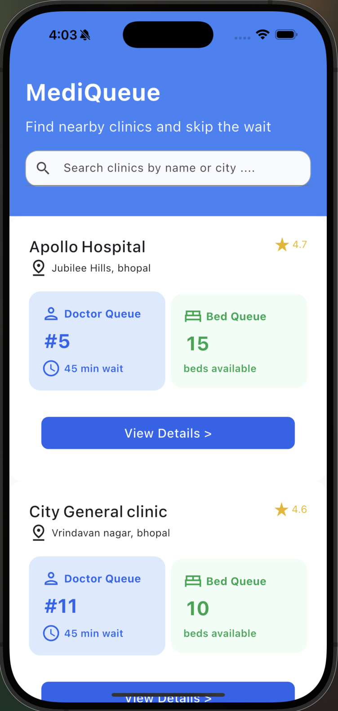
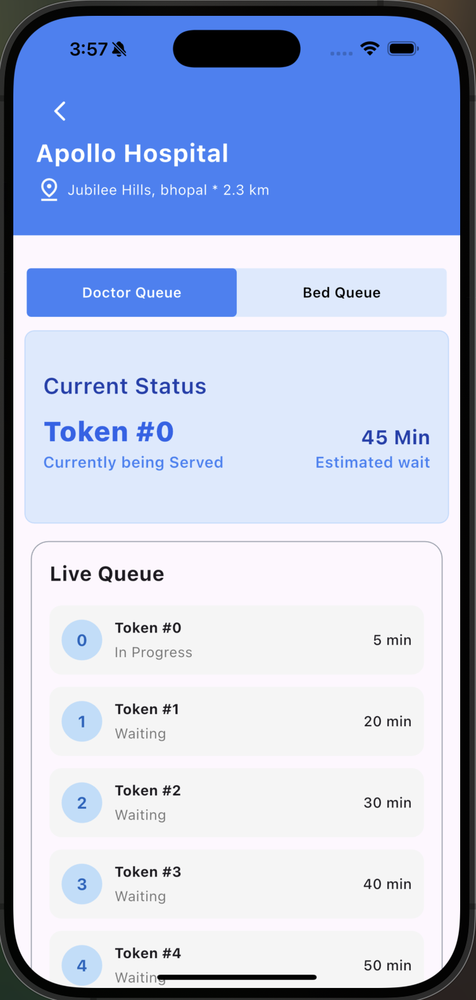
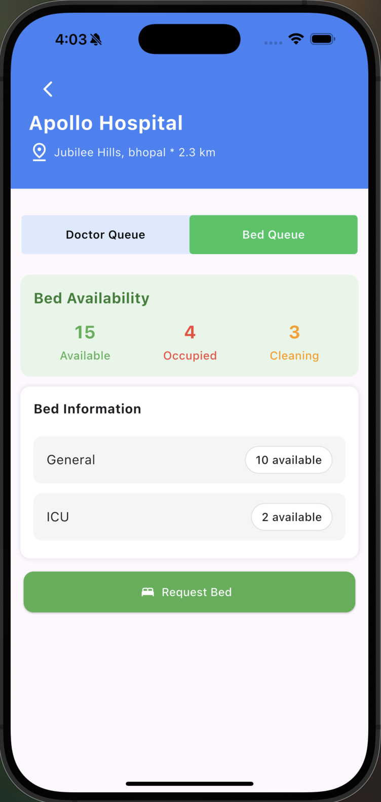
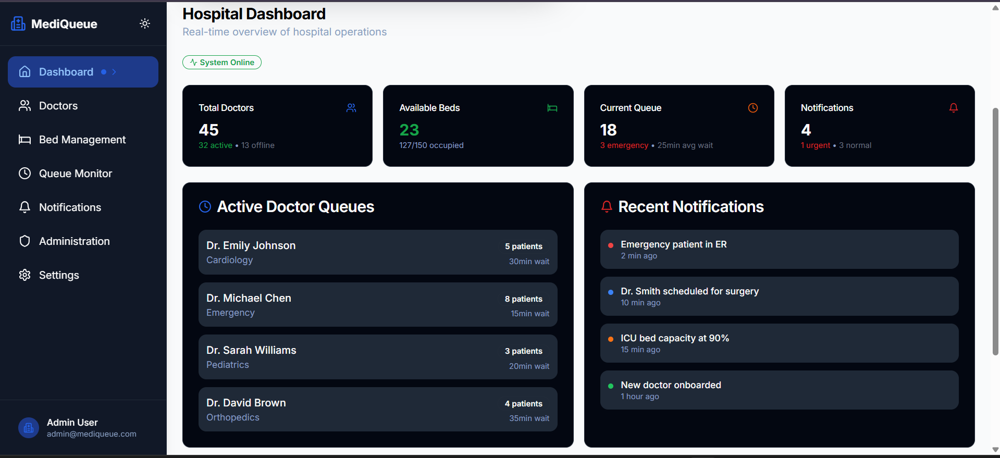
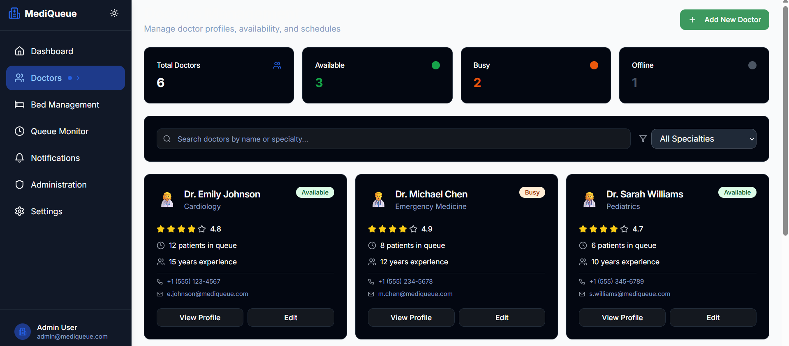
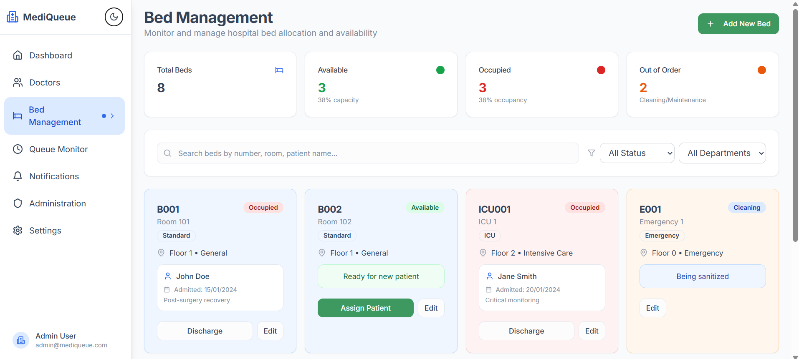
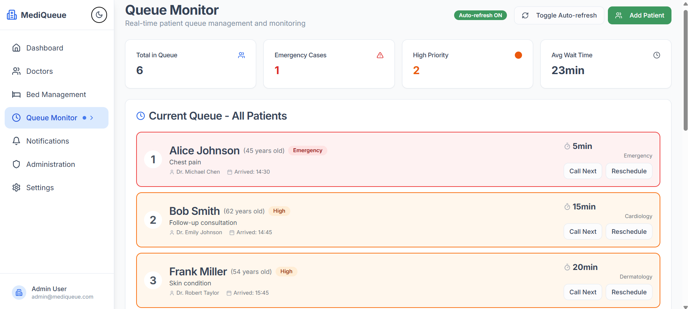
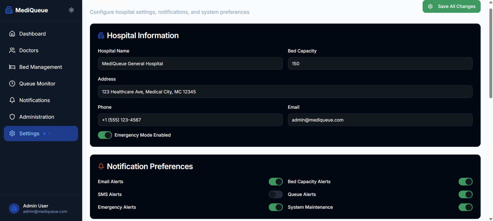

# 🏥 MediQueue - Smarter Queue & Bed Management System

**MediQueue** is an innovative, real-time hospital queue and bed request system designed to minimize patient wait times and enhance healthcare operational efficiency. Built for clinics and hospitals, MediQueue streamlines doctor consultations and bed requests through an intuitive, modern digital interface.

---

## 📌 Problem Statement

Hospitals and clinics often face challenges with disorganized queues and inefficient bed allotment processes. These issues lead to:

- ⏳ Long waiting times  
- 🧑‍🤝‍🧑 Overcrowding  
- ❌ Poor communication  
- 😟 Increased stress for patients and healthcare providers  

Traditional methods like manual tokens or paper-based systems are prone to errors and lack transparency. **MediQueue** aims to solve this with a smarter digital solution.

---

## 🛠 Project Description

MediQueue delivers a comprehensive and scalable system for managing hospital queues and bed requests efficiently.  

### 🔑 Core Features

- ⏱ **Real-time Queue Tracking**: Track progress for doctor consultations and bed availability.  
- 🔔 **Smart Notifications**: Receive real-time updates on queue movements and availability.  
- 📱 **Mobile App for Patients**: Join queues, track your place, and stay updated.  
- 🖥 **Web Admin Portal**: Manage appointments, bed occupancy, and overall hospital flow.  
- 🔐 **Role-based Access Control**: Different logins for patients, staff, and admins.  
- ✉️ **Automated Reminders**: Get SMS/email reminders for queue status.  
- 🕐 **Estimated Wait Times**: Transparency on waiting periods for better planning.

---
## 📸 Application Snapshots

### 📲 Mobile App - Patient View [Dashboard]


- View a snapshot of your current *queue status* and *notifications*.
- Easily navigate to *doctor* or *bed queues* with a single tap.

### 📲 Mobile App - Patient View [Doctor Queue]



- Easily *join queues* remotely.
- View *real-time progress* and *estimated wait times*.

### 📲 Mobile App - Patient View [Bed Queue]



- Submit *bed requests* digitally without standing in lines.
- Track *bed availability* and request *status updates* in real time.

---

### 💻 Admin Portal - Web View [Dashboard]


- Get a quick overview of key *metrics* like *active queues* and *available beds*.
- Monitor *real-time hospital activity* from a single screen.

### 💻 Admin Portal - Web View [Doctor Management]


- View and manage *doctor queues*.
- Serve or skip *patients* and update *doctor availability*.

### 💻 Admin Portal - Web View [Bed Management]


- Track *bed occupancy* and handle *bed requests*.
- Update *availability status* and manage *assignments* efficiently.

### 💻 Admin Portal - Web View [Queue Management]


- Oversee all *active queues* for *doctors* and *beds*.
- View *patient positions, serve or skip entries in **real time*.

### 💻 Admin Portal - Web View [Settings]


- Configure *user roles, **notifications, and **system preferences*.
- Control *access levels* for *patients, **staff, and **administrators*.

---

## 🎯 Who Will Benefit?

- 👨‍⚕️ **Doctors**: Efficient scheduling and patient flow  
- 🧑‍⚕️ **Healthcare Staff**: Reduced manual workload and clearer oversight  
- 🏥 **Clinics & Hospitals**: Better resource utilization and smoother operations  
- 🧍‍♂️ **Patients**: Less waiting, better communication, and real-time updates

---

## 🚀 What Makes MediQueue Unique?

- 🔄 **Dual Queue System**: Separate logic for doctor consultations and bed requests  
- 📡 **Real-time Updates**: Patients and staff stay informed  
- 🧭 **Modern, User-Friendly Interface**: Easy to navigate for all users  
- 🏠 **Remote Queue Access**: Join from home, avoid long physical lines  
- 📱 **Cross-Platform Support**: Web portal and mobile app (Android app coming soon!)  
- 📣 **Transparency & Notifications**: Boost patient satisfaction with clear communication

---

## ⚙️ Tech Stack

### 🌐 Frontend (Admin Portal)
- **ReactJS**
- **Tailwind CSS**
- **Vite**

### 📱 Mobile App
- **Flutter** (Cross-platform)
- **Firebase Cloud Messaging**

### 🔧 Backend
- **Node.js**
- **Express.js**
- **Firebase** (Authentication, Firestore, Cloud Functions)

### ☁️ Deployment & DevOps
- **Vercel**: Frontend hosting
- **Netlify / Render**: Backend deployment
- **Git & GitHub**: Version control & collaboration

---

## 🔄 System Flows

### 👤 Patient Workflow
1. Register/Login  
2. View available clinics & doctors  
3. Join doctor queue  
4. Request bed (if needed)  
5. Track position & receive notifications  

### 🏥 Admin/Staff Workflow
1. View & manage doctor queues  
2. Serve or skip patients  
3. View & process bed requests  
4. Update bed occupancy status  

---


## 📄 License

MIT License © 2025 [MediQueue Team](#)

---

> Made with ❤️ to make healthcare smarter and more accessible.
```
